# DCC Railway Control System - Design Documentation

## 📋 Table of Contents
1. [System Overview](#system-overview)
2. [Architecture Overview](#architecture-overview)
3. [Database Design](#database-design)
4. [Component Architecture](#component-architecture)
5. [API Design](#api-design)
6. [User Interface Architecture](#user-interface-architecture)
7. [Security Model](#security-model)
8. [Data Flow Diagrams](#data-flow-diagrams)
9. [Deployment Architecture](#deployment-architecture)
10. [UML Diagrams](#uml-diagrams)

---

## 📖 System Overview

The DCC Railway Control System is a comprehensive web-based application for managing digital model railway operations. It provides functionality for locomotive management, train scheduling, station network management, and route planning with collision detection.

### Key Features
- **Locomotive Management**: Digital locomotive inventory with DCC addressing
- **Train Scheduling**: Advanced train creation with route validation and conflict detection
- **Station Network**: Complete station and track connection management
- **Timetable System**: Traditional railway timetables and German-style Buchfahrplan
- **User Authentication**: Role-based access control (Admin, Operator, Viewer)
- **Real-time Operations**: Live monitoring and control capabilities

---

## 🏗️ Architecture Overview

### System Architecture Pattern
The system follows a **3-Tier Architecture** pattern:

```
┌─────────────────────────────────────────────────────┐
│                PRESENTATION TIER                    │
│  ┌─────────────┐ ┌─────────────┐ ┌─────────────┐   │
│  │   Web UI    │ │  Dashboard  │ │   Mobile    │   │
│  │  (HTML/JS)  │ │   (HTML)    │ │   (PWA)     │   │
│  └─────────────┘ └─────────────┘ └─────────────┘   │
└─────────────────────────────────────────────────────┘
                          │ HTTP/AJAX
┌─────────────────────────────────────────────────────┐
│                 BUSINESS LOGIC TIER                 │
│  ┌─────────────┐ ┌─────────────┐ ┌─────────────┐   │
│  │   Auth API  │ │  Trains API │ │  Stations   │   │
│  │     PHP     │ │     PHP     │ │    API      │   │
│  └─────────────┘ └─────────────┘ └─────────────┘   │
│  ┌─────────────┐ ┌─────────────┐ ┌─────────────┐   │
│  │Locomotives  │ │ Route Val.  │ │  Enhanced   │   │
│  │    API      │ │     API     │ │ Train API   │   │
│  └─────────────┘ └─────────────┘ └─────────────┘   │
└─────────────────────────────────────────────────────┘
                          │ PDO/MySQL
┌─────────────────────────────────────────────────────┐
│                   DATA TIER                         │
│                                                     │
│              MySQL Database                         │
│          (highball_highball)                        │
│                                                     │
└─────────────────────────────────────────────────────┘
```

### Technology Stack
- **Frontend**: HTML5, CSS3, JavaScript (ES6+), PWA capabilities
- **Backend**: PHP 8.x with PDO
- **Database**: MySQL 8.0+ with utf8mb4 collation
- **Authentication**: Session-based with secure token management
- **APIs**: RESTful JSON APIs

---

## 🗄️ Database Design

### Entity Relationship Diagram (ERD)

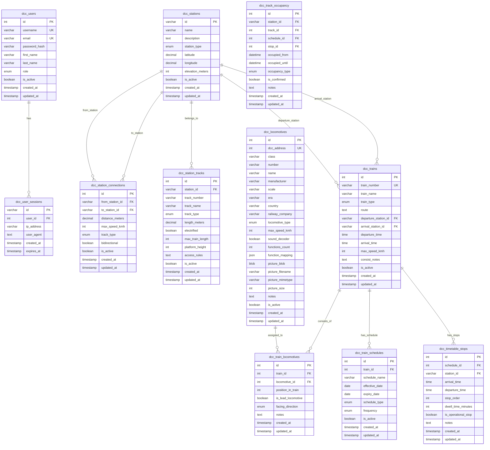

### Database Schema Summary

#### Core Entities
1. **Users & Authentication**
   - `dcc_users`: User accounts with role-based access
   - `dcc_user_sessions`: Session management for authentication

2. **Railway Infrastructure**
   - `dcc_stations`: Station definitions with geographic data
   - `dcc_station_connections`: Track connections between stations
   - `dcc_station_tracks`: Individual tracks within stations

3. **Rolling Stock**
   - `dcc_locomotives`: Digital locomotive inventory
   - `dcc_trains`: Train service definitions
   - `dcc_train_locomotives`: Locomotive consists (many-to-many)

4. **Operations**
   - `dcc_train_schedules`: Train scheduling information
   - `dcc_timetable_stops`: Individual station stops
   - `dcc_track_occupancy`: Resource management and conflict prevention

---

## 🧩 Component Architecture

### System Components Diagram

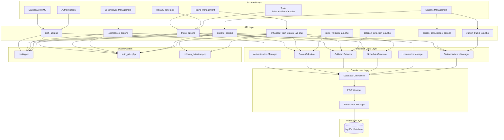

### Component Responsibilities

#### Frontend Components
- **Dashboard**: System overview and quick access
- **Train Management**: CRUD operations for trains and consists
- **Locomotive Management**: Digital locomotive inventory
- **Station Management**: Station and track configuration
- **Timetable Views**: Classical and German-style timetables
- **Authentication**: User login and session management

#### API Components
- **Authentication API**: User management and session handling
- **Trains API**: Train operations and schedule calculations
- **Locomotives API**: Locomotive management and assignments
- **Stations API**: Station and infrastructure management
- **Enhanced Train Creator**: Advanced train creation with validation
- **Route Validator**: Path finding and route validation
- **Collision Detection**: Conflict prevention and resource management

#### Business Logic Components
- **Route Calculator**: Dijkstra's algorithm for optimal path finding
- **Collision Detector**: Time-based conflict detection
- **Schedule Generator**: Automatic timetable generation
- **Locomotive Manager**: Consist management and availability tracking
- **Station Network Manager**: Infrastructure topology management

---

## 🔌 API Design

### REST API Endpoints

#### Authentication API (`auth_api.php`)
```
POST /auth_api.php?action=register    # User registration
POST /auth_api.php?action=login       # User login
POST /auth_api.php?action=logout      # User logout
GET  /auth_api.php?action=profile     # Get user profile
GET  /auth_api.php?action=validate    # Validate session
```

#### Trains API (`trains_api.php`)
```
GET    /trains_api.php?action=list              # List trains
GET    /trains_api.php?action=get&id={id}       # Get train details
POST   /trains_api.php?action=create            # Create train
PUT    /trains_api.php?action=update&id={id}    # Update train
DELETE /trains_api.php?action=delete&id={id}    # Delete train
POST   /trains_api.php?action=calculate_schedule # Calculate route schedule
GET    /trains_api.php?action=available_locomotives # Get available locomotives
POST   /trains_api.php?action=update_consist&id={id} # Update train consist
```

#### Locomotives API (`locomotives_api.php`)
```
GET    /locomotives_api.php?action=list                    # List locomotives
GET    /locomotives_api.php?action=get&id={id}             # Get locomotive details
GET    /locomotives_api.php?action=by_address&address={n}  # Get by DCC address
POST   /locomotives_api.php?action=create                  # Create locomotive
PUT    /locomotives_api.php?action=update&id={id}          # Update locomotive
DELETE /locomotives_api.php?action=delete&id={id}          # Delete locomotive
GET    /locomotives_api.php?action=picture&id={id}         # Get locomotive picture
POST   /locomotives_api.php?action=upload_picture&id={id}  # Upload picture
DELETE /locomotives_api.php?action=delete_picture&id={id}  # Delete picture
```

#### Enhanced Train Creator API (`enhanced_train_creator_api.php`)
```
POST /enhanced_train_creator_api.php?action=validate_only     # Validate route only
POST /enhanced_train_creator_api.php?action=create_validated  # Create with validation
```

#### Route Validator API (`route_validator_api.php`)
```
GET /route_validator_api.php?action=validate_route   # Validate route between stations
GET /route_validator_api.php?action=find_route       # Find optimal route
```

### API Response Format
All APIs follow a consistent JSON response format:

```json
{
  "status": "success|error",
  "message": "Human readable message",
  "data": { ... },           // For successful responses
  "error": "Error message",  // For error responses
  "details": [ ... ],        // Additional error details
  "pagination": {            // For paginated responses
    "page": 1,
    "limit": 50,
    "total": 123,
    "pages": 3
  }
}
```

---

## 🎨 User Interface Architecture

### UI Component Hierarchy

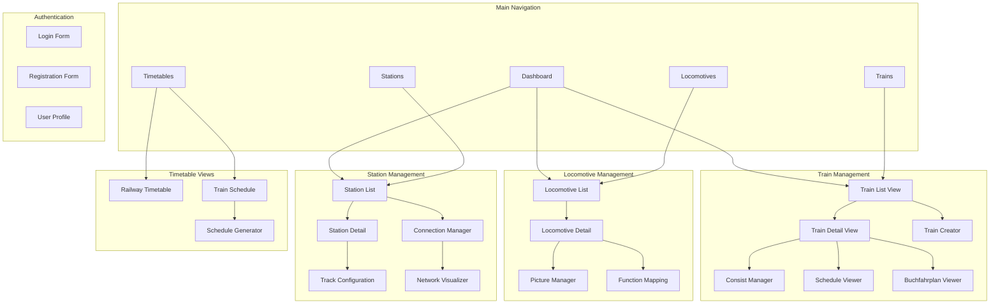

### UI Design Patterns

#### 1. Responsive Grid Layout
- Mobile-first design approach
- CSS Grid and Flexbox for layouts
- Breakpoints: Mobile (768px), Tablet (1024px), Desktop (1200px+)

#### 2. Component-Based Architecture
- Reusable UI components
- Consistent styling with CSS custom properties
- Progressive enhancement

#### 3. State Management
- Client-side state management with JavaScript
- Session storage for user preferences
- Real-time updates via AJAX polling

---

## 🔒 Security Model

### Authentication & Authorization

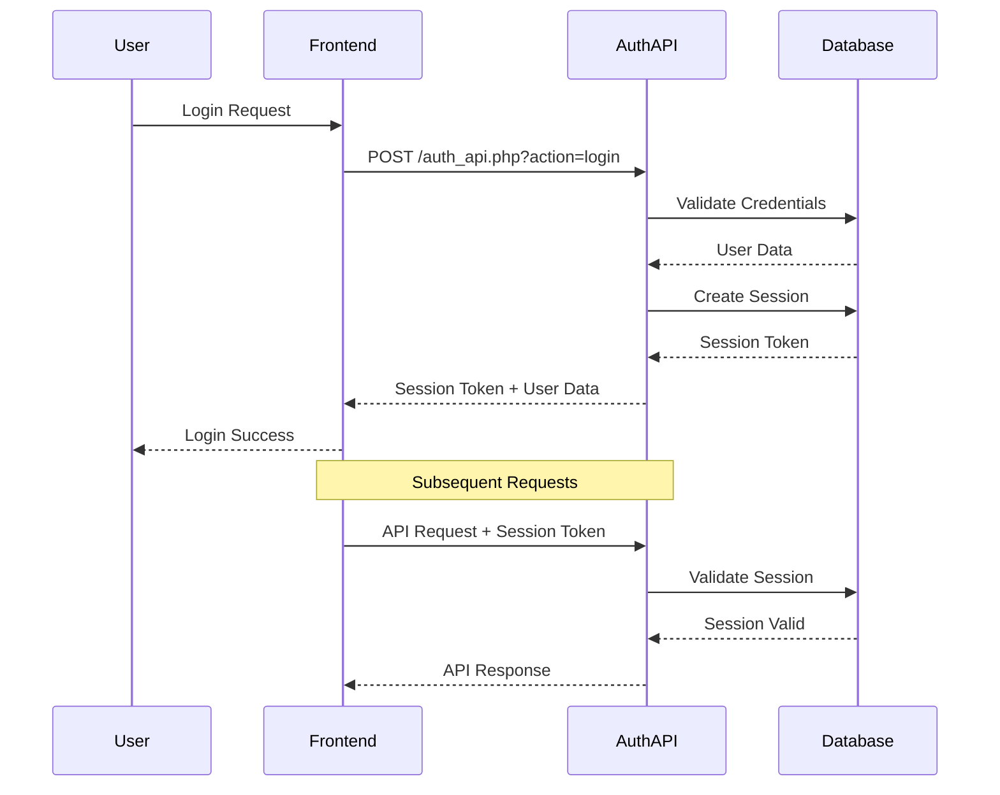

### Security Features

#### 1. Role-Based Access Control (RBAC)
- **Admin**: Full system access, user management
- **Operator**: Train and locomotive management
- **Viewer**: Read-only access to all data

#### 2. Session Management
- Secure session tokens (128-character random)
- 24-hour session expiration
- IP and User-Agent validation
- Automatic cleanup of expired sessions

#### 3. Input Validation
- SQL injection prevention with PDO prepared statements
- XSS protection with input sanitization
- CSRF protection with token validation
- File upload validation for locomotive pictures

#### 4. Database Security
- UTF-8 character encoding
- Parameterized queries
- Foreign key constraints
- Data integrity validation

---

## 📊 Data Flow Diagrams

### Train Creation Flow

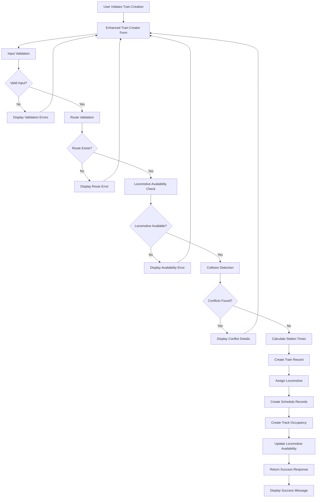

### Schedule Calculation Flow

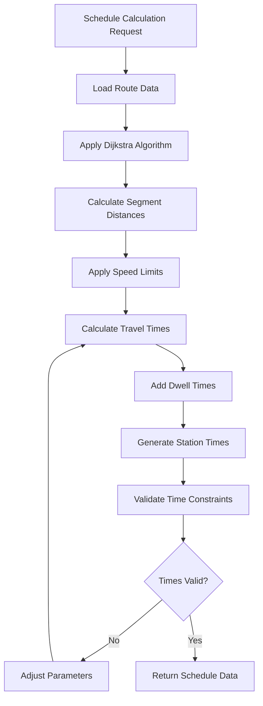

### Collision Detection Flow

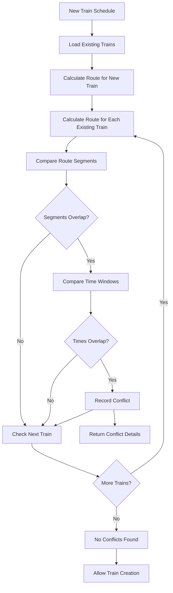

---

## 🚀 Deployment Architecture

### Production Environment

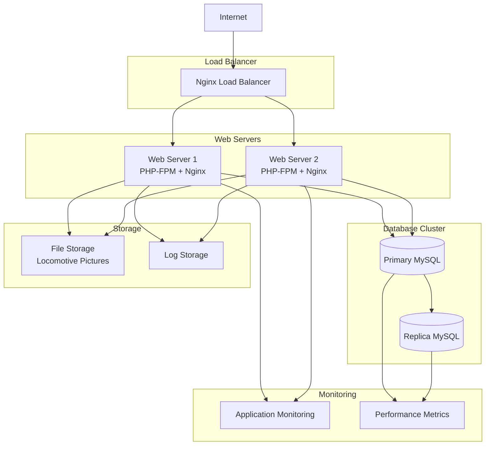

### Deployment Specifications

#### Web Server Configuration
- **Server**: Nginx 1.20+ with PHP-FPM 8.1+
- **SSL**: TLS 1.3 with Let's Encrypt certificates
- **Caching**: Browser caching for static assets
- **Compression**: Gzip compression enabled

#### Database Configuration
- **Engine**: MySQL 8.0+ with InnoDB storage engine
- **Charset**: utf8mb4 with utf8mb4_general_ci collation
- **Backup**: Daily automated backups with point-in-time recovery
- **Replication**: Master-slave replication for read scaling

#### Security Configuration
- **Firewall**: UFW with restricted port access
- **SSL/TLS**: A+ grade SSL configuration
- **Headers**: Security headers (HSTS, CSP, X-Frame-Options)
- **Updates**: Automatic security updates enabled

---

## 📐 UML Diagrams

### Class Diagram - Core System Classes

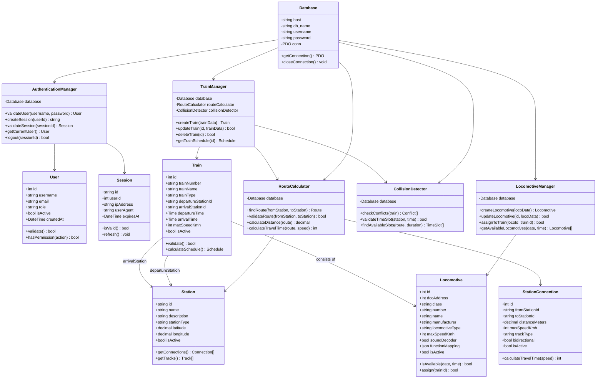

### Sequence Diagram - Enhanced Train Creation

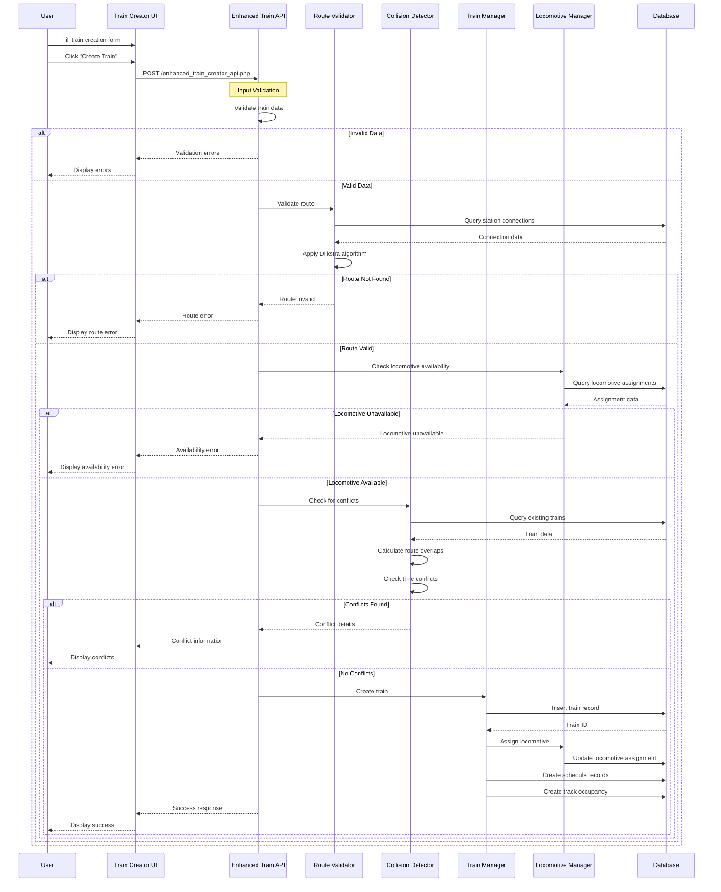

### State Diagram - Train Lifecycle

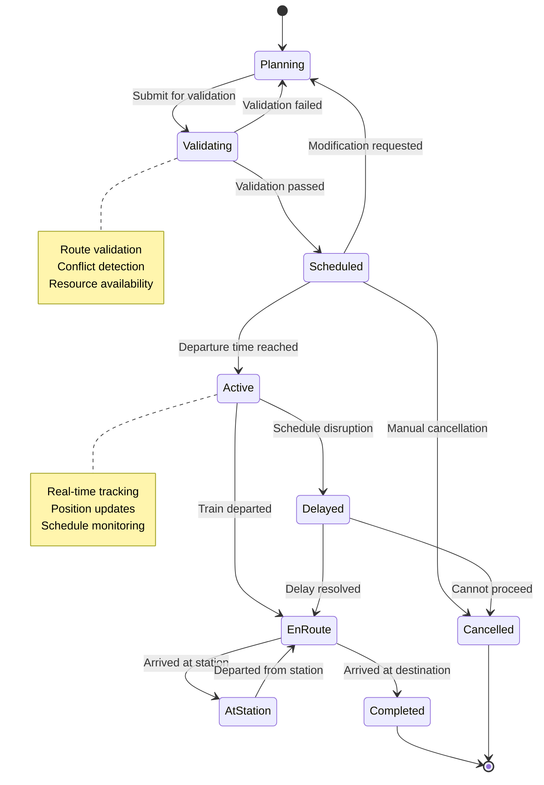

### Component Diagram - API Layer

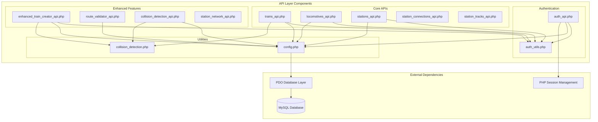

---

## 📝 Summary

This design documentation provides a comprehensive overview of the DCC Railway Control System architecture. The system implements modern software engineering principles including:

- **Separation of Concerns**: Clear separation between presentation, business logic, and data layers
- **RESTful API Design**: Consistent, stateless API interfaces
- **Security Best Practices**: Role-based access control and secure session management
- **Scalable Architecture**: Component-based design supporting horizontal scaling
- **Data Integrity**: Comprehensive validation and conflict detection
- **User Experience**: Responsive, accessible web interfaces

The system successfully balances the complexity of railway operations management with modern web application development practices, providing a robust platform for digital model railway control and management.

---

*Document Version: 1.0*  
*Last Updated: August 5, 2025*  
*Author: DCC Railway Control System Development Team*
